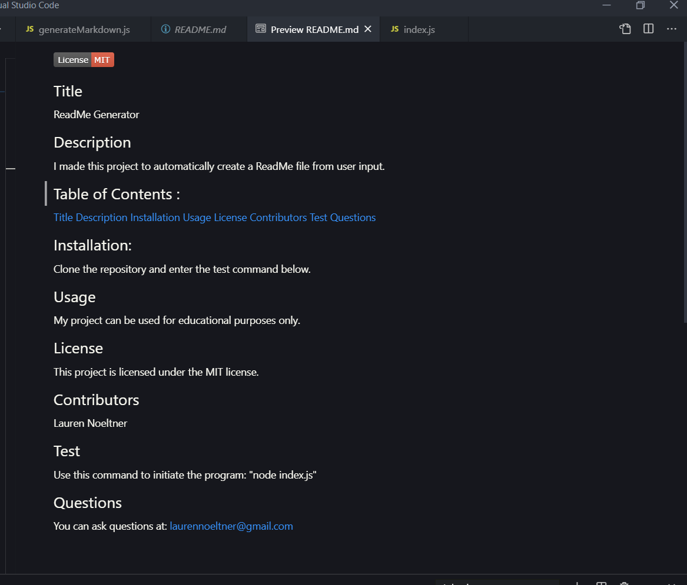

## Title

ReadMe Generator

## Description

I made this project to automatically create a ReadMe file from user input. With this program, a user can quickly make a professional ReadMe file for any project they have.

Sample ReadMe

Video Walkthrough:
https://drive.google.com/file/d/1sFaMU9H7_msGFSPGjWAztQ7u966B-5Lc/view?usp=sharing

## Table of Contents :

[Title](#Title)
[Description](#Description)
[Installation](#Installation)
[Usage](#Usage)
[License](#License)
[Contributors](#Contributors)
[Test](#Test)
[Questions](#Questions)

## Installation:

Clone the repository and enter the test command below in your console.

## Usage

My project can be used for educational purposes only.

## License

This project is licensed under the MIT license.

## Contributors

Lauren Noeltner

## Test

Use this command to initiate the program: "node index.js"

## Questions

You can ask questions by messaging Lauren at: https://github.com/LNoeltner1
